# Faza 5 - UML Dokumentacija (Modelovanje)

## Dijagram klasa

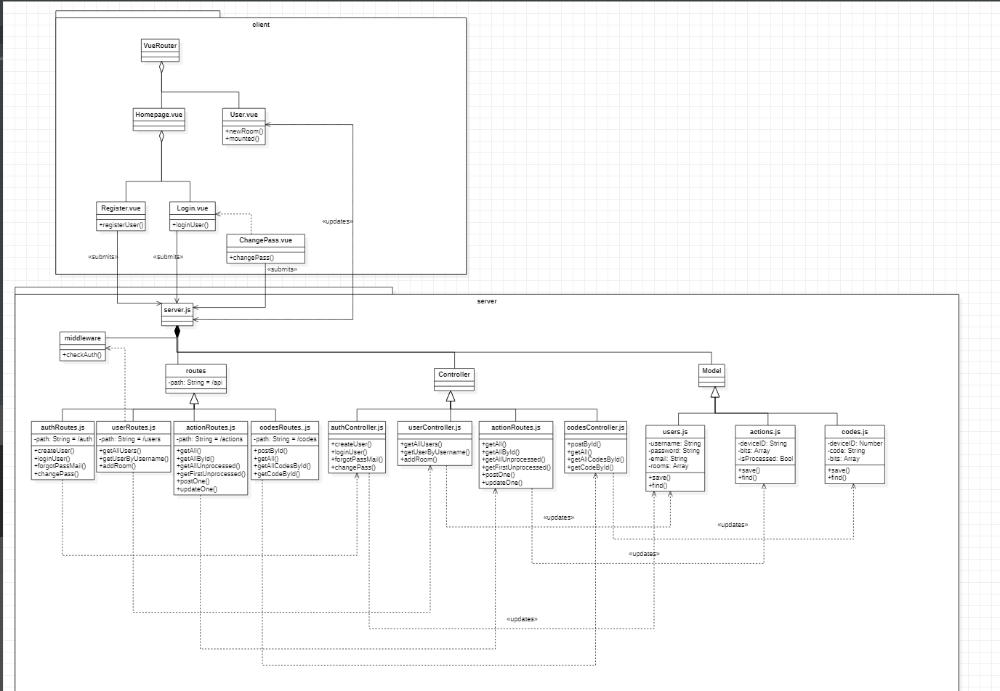

## Use-case dijagram

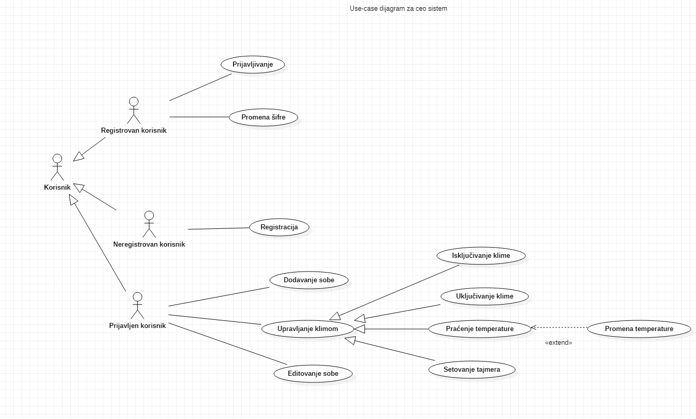

## SSU 1 - Registracija korisnika

### Uspeh

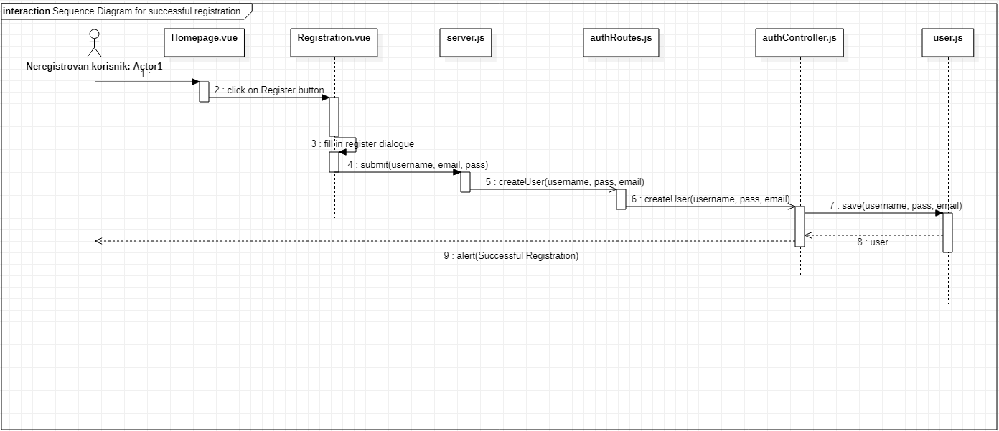

### Neuspeh

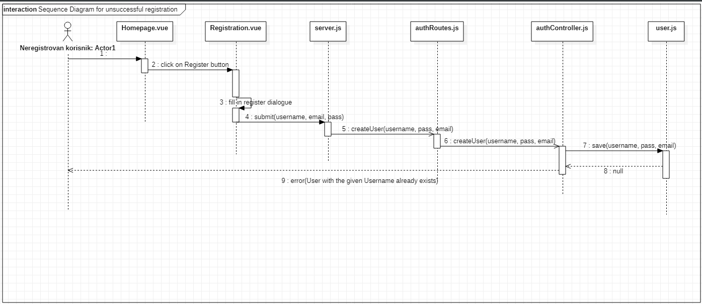

---

## SSU 2 - Prijavljivanje korisnika

### Uspeh

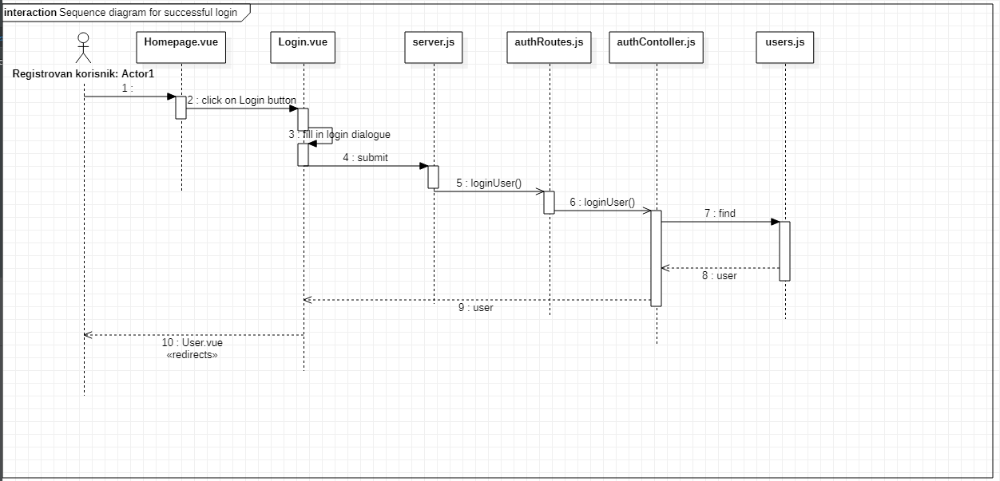

### Neuspeh

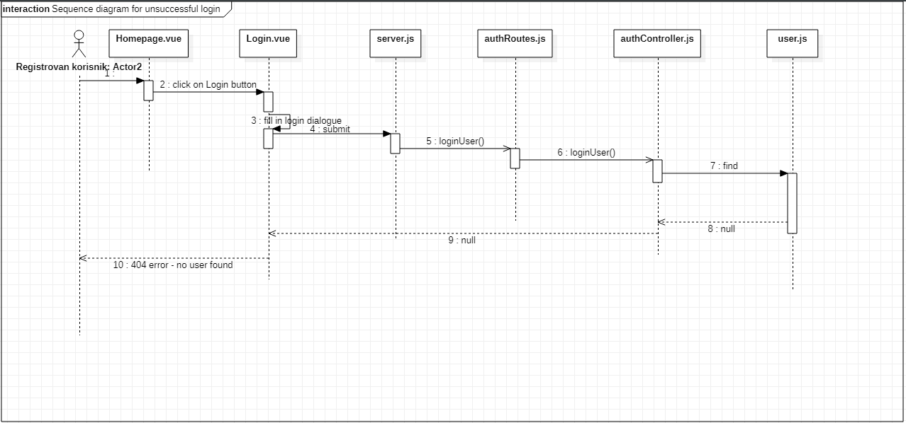

---

## SSU 3 - Dodavanje sobe

### Uspeh

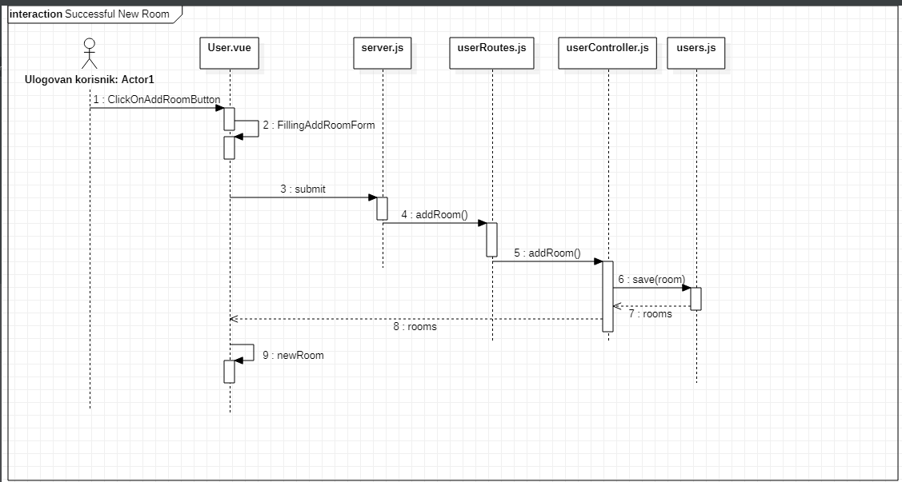

### Neuspeh

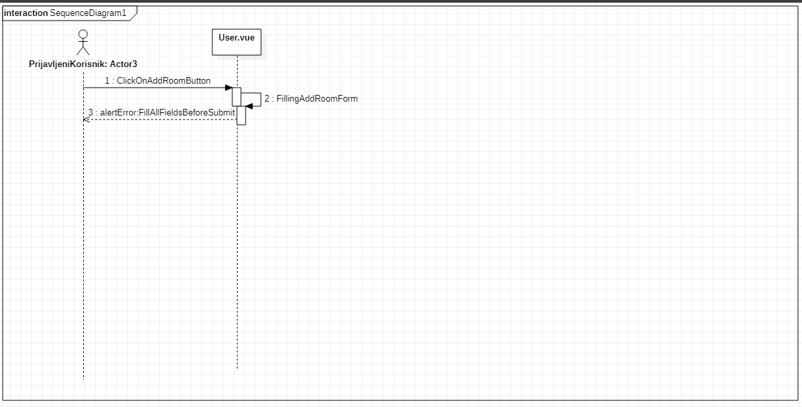

---

## SSU 4 - Promena lozinke

### Uspeh

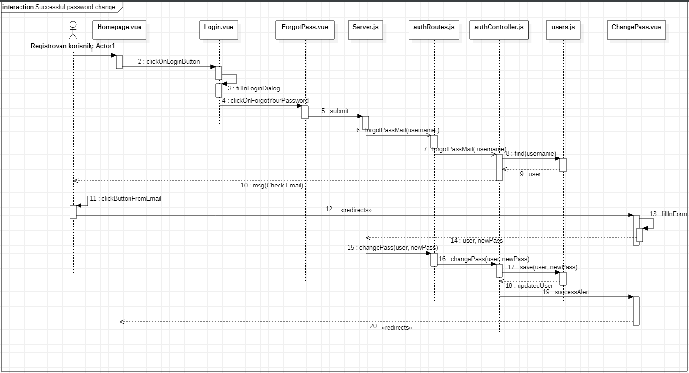

### Neuspeh

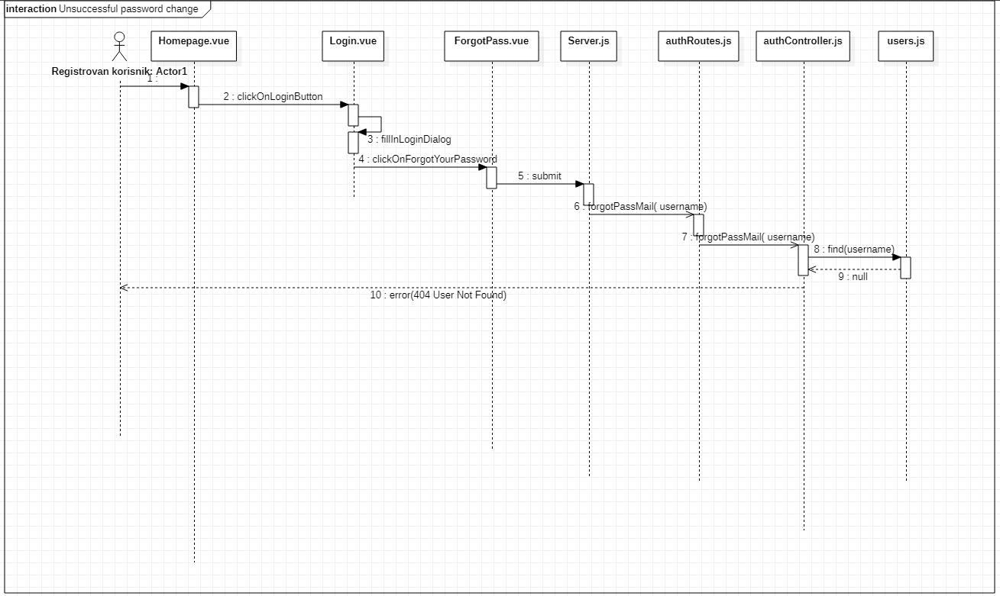

---

## SSU 5 - Menjanje temperature

### Uspeh

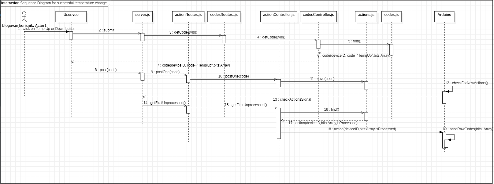

### Neuspeh

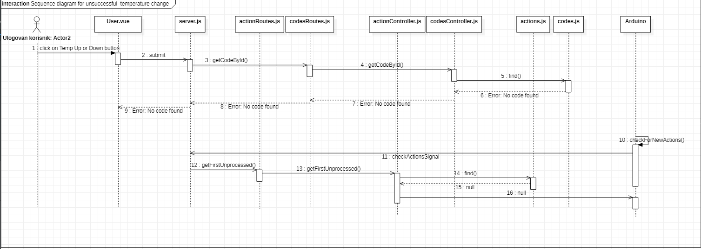

---

## SSU 6 - Uključivanje klime

### Uspeh

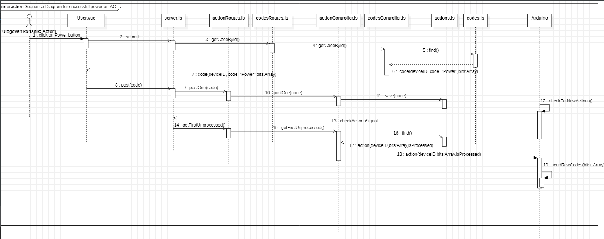

### Neuspeh

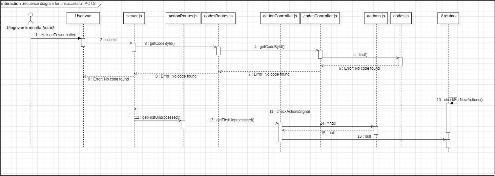

---

## SSU 7 - Postavljanje tajmera

### Uspeh

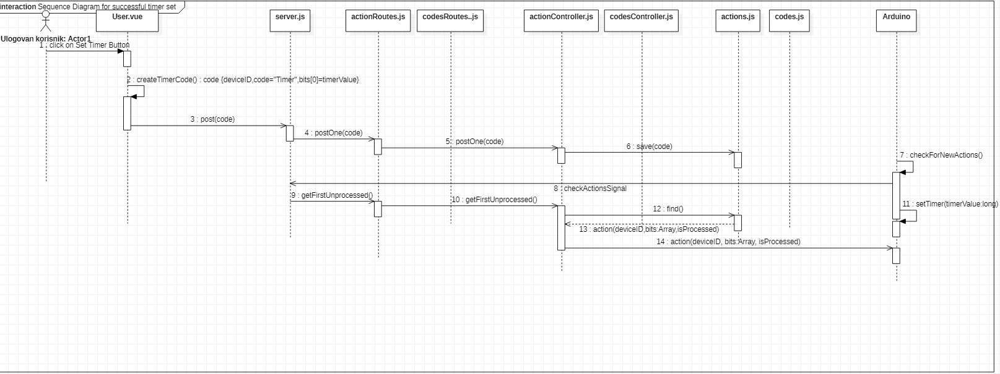

### Neuspeh

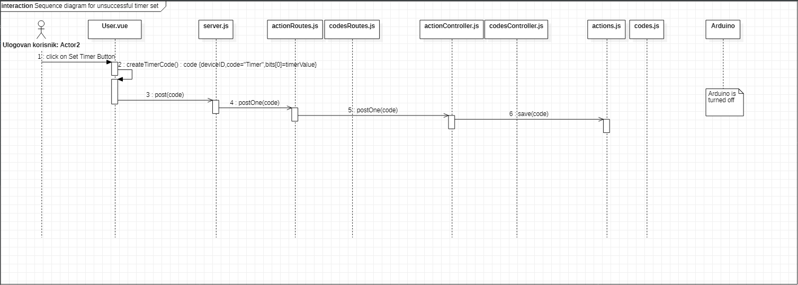

---

## SSU 8 - Praćenje temperature

### Uspeh

### Neuspeh

